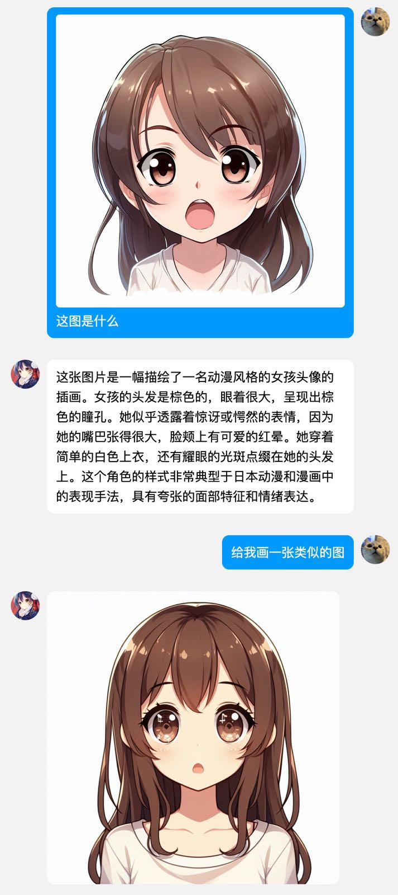
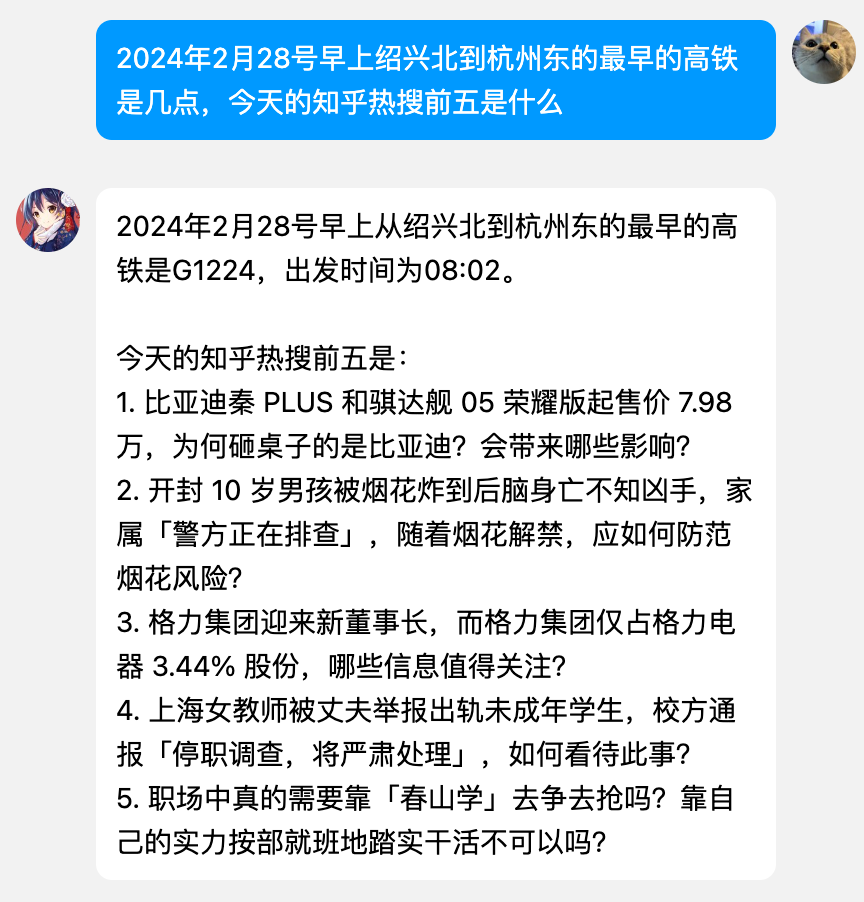

# QQ Bot

[](https://github.com/Lick-Dog-Club/qq-bot/actions/workflows/build.yaml)

> qq 机器人
>
> 详细咨询请加 QQ 1025434218, 注明来源

## 指令 (y代表可ai交互的指令)

```text
@bot	(y)to           	查询车票信息, 只显示有票的班次, 例如: 'to 杭州东 绍兴北 20240216'
@bot	(y)t            	查询高铁/火车票信息, 例如: 't 杭州东 绍兴北 20240216'
@bot	(y)mt-login     	<+phone> <+code>: 预约申购茅台登录，通过6位短信验证码登录用户
@bot	(x)mt-geo       	<+phone> <+地址,高德自动查询 geo> 设置经纬度
@bot	(y)mt           	<+phoneNum>: 通过手机号自动预约申购茅台
@bot	(x)mt-jwd       	<+phone> <+lat,lng> 设置经纬度
@bot	(x)mt-del       	<+phoneNum>: 取消茅台自动预约
@bot	(x)mt-list      	当前用户以及过期时间
@bot	(x)mt-reward    	领取小游戏奖励
@bot	(x)mt-game-up   	加速小游戏
@bot	(x)starx        	<+date: 2000-01-01> 根据日期获取对应的星座运势
@bot	(y)star         	<+date: 2000-01-01> 根据日期获取对应的星座
@bot	(y)p            	<+n/r/rai> 返回 pixiv 热门图片
@bot	(y)see          	<+图片url>: 根据 url 识别图片内容
@bot	(y)draw         	<+prompt>: 使用 ai 画图
@bot	(x)clear        	清除 ai 历史对话记录
@bot	(y)GetCodeByName	根据名称获取股票代码
@bot	(x)listtask     	任务列表
@bot	(x)canceltask   	取消任务
@bot	(x)task         	添加任务
@bot	(x)help         	帮助信息
@bot	(y)bili-lottery 	<+bilibili-cookie> bilibili 抽奖, 自动转发up主的抽奖活动
@bot	(x)next-holiday 	获取下一个节假日, 获取下一个法定节假日, 返回节日名称和具体的放假时间
@bot	(y)holiday      	获取节假日数据, 获取法定节假日数据, 返回节日名称和具体的放假时间
@bot	(y)ddys         	<+dy/dm>, 获取最新的电影、动漫资讯, 默认 +dy
@bot	(y)kfc          	KFC 骚话, 返回肯德基疯狂星期四文案
@bot	(y)lpr          	获取当前贷款市场报价利率(lpr)数值
@bot	(y)weather      	<+城市> 获取天气信息, 默认杭州
@bot	(y)dx           	股票新债/打新，查询今日是否有新债
@bot	(y)weibo        	获取今日实时的微博热搜榜单
@bot	(y)zuan         	返回一句祖安/骂人的话
@bot	(y)geo          	geo 地理位置查询
@bot	(x)webot        	微信机器人扫码登录
@bot	(y)tip          	获取一个生活小窍门
@bot	(y)zhihu        	获取知乎热搜榜单
@bot	(y)pic          	返回动漫图片~
@bot	(y)rkl          	获取一个绕口令
@bot	(y)stock        	分析股票
@bot	(x)gm           	早上好
@bot	(x)default      	ai 自动回答
```

## Example




